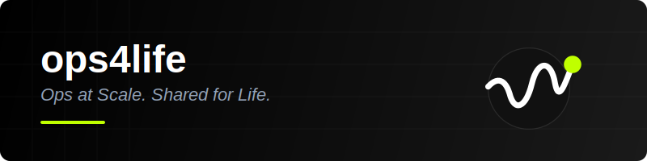

  
   
  <h1>Welcome to ops4life 🚀</h1>
  
<strong>Ops at Scale. Shared for Life.</strong>

  
  
  

---

## 🚀 The ops4life Mission

**ops4life** is dedicated to building and sharing high-quality tools, workflows, and best practices to help engineering teams scale their operations. We focus on:

- ⚙️ **Automation** - Robust CI/CD pipelines and task automation.
- 🏗️ **Infrastructure as Code** - Standardized patterns for cloud and on-prem.
- 📊 **Observability** - Deep insights into system health and performance.
- 🛡️ **Security** - Integrated DevSecOps practices.

---

## 📁 This Repository (`.github`)

This specific repository acts as the **central configuration hub** for the ops4life organization. It contains:

### 📦 Key Components

1.  **[Workflow Templates](workflow-templates/)** - Standardized starter templates for new repositories.
2.  **Reusable Workflows** - Common CI/CD patterns (GitHub Actions) used across the org.
3.  **Organization Profile** - The public landing page for our GitHub organization.

---

## 🛡️ Available Resources (GitHub Actions)

Enable these templates when creating new workflows in your repositories:

### 🔒 Security & Compliance
-   **Gitleaks** - Secret scanning to detect and prevent exposed credentials.
-   **CodeQL Analysis** - Advanced semantic analysis for vulnerability detection.
-   **Dependency Review** - Security and license scanning for project dependencies.

### 💎 Code Quality
-   **PR Title Linting** - Enforces conventional commit format for clean history.
-   **Pre-commit CI** - Automated enforcement of pre-commit hooks.

---

## 📂 Public Repositories

Explore our ecosystem of open-source tools, templates, and learning resources.

### 🛠️ Tools & CLI
| Repository | Description |
| :--- | :--- |
| **[🤖 claudekit](https://github.com/ops4life/claudekit)** | Claude Code plugin for DevOps and SRE workflows. |
| **[🔄 awsp](https://github.com/ops4life/awsp)** | Tiny cross-shell function to switch AWS profiles effortlessly. |
| **[🔐 kubeseal-vscode](https://github.com/ops4life/kubeseal-vscode)** | VS Code integration for encrypting/decrypting Kubernetes secrets. |
| **[🐳 terraform-toolkit](https://github.com/ops4life/terraform-toolkit-docker)** | Docker image with Terraform, Terragrunt, Checkov, and more. |
| **[💻 code-server](https://github.com/ops4life/code-server)** | Specialized code-server image with pre-installed DevOps tools. |

### 🏗️ Infrastructure & Templates
| Repository | Description |
| :--- | :--- |
| **[☸️ eks-iac-template](https://github.com/ops4life/eks-iac-template)** | Production-ready EKS infrastructure with Terraform and Kustomize. |
| **[🏗️ terraform-template](https://github.com/ops4life/terraform-repo-template)** | AWS Terraform template with integrated CI/CD and security. |
| **[☁️ aws-terraform-ado](https://github.com/ops4life/aws-terraform-ado)** | Structured Terraform patterns for Azure DevOps pipelines. |
| **[📋 github-template](https://github.com/ops4life/github-repo-template)** | Best-practice template for new GitHub repositories. |
| **[⚙️ .github](https://github.com/ops4life/.github)** | (This repo) Org-wide workflows, templates, and config. |

### 📚 Learning & Community
| Repository | Description |
| :--- | :--- |
| **[🗺️ roadmaps](https://github.com/ops4life/roadmaps)** | Interactive roadmaps for DevOps, DevSecOps, and MLOps. |
| **[🤖 mlops-guides](https://github.com/ops4life/mlops-get-started)** | Practical examples and code snippets for MLOps practitioners. |
| **[✨ spark](https://github.com/ops4life/spark)** | Community hub for ideas, feedback, and organizational suggestions. |

---

## 🤝 Community & Contributing

We are a community-driven organization. Whether you're fixing a bug, adding a feature, or sharing a new DevOps pattern, we welcome your contributions!

1.  Check [CLAUDE.md](CLAUDE.md) for technical guidelines.
2.  Visit our [Organization Profile](profile/README.md) for a full list of repositories.
3.  Follow [Conventional Commits](https://www.conventionalcommits.org/).

---

## 📄 License

This project is licensed under the MIT License - see the [LICENSE](LICENSE) file for details.